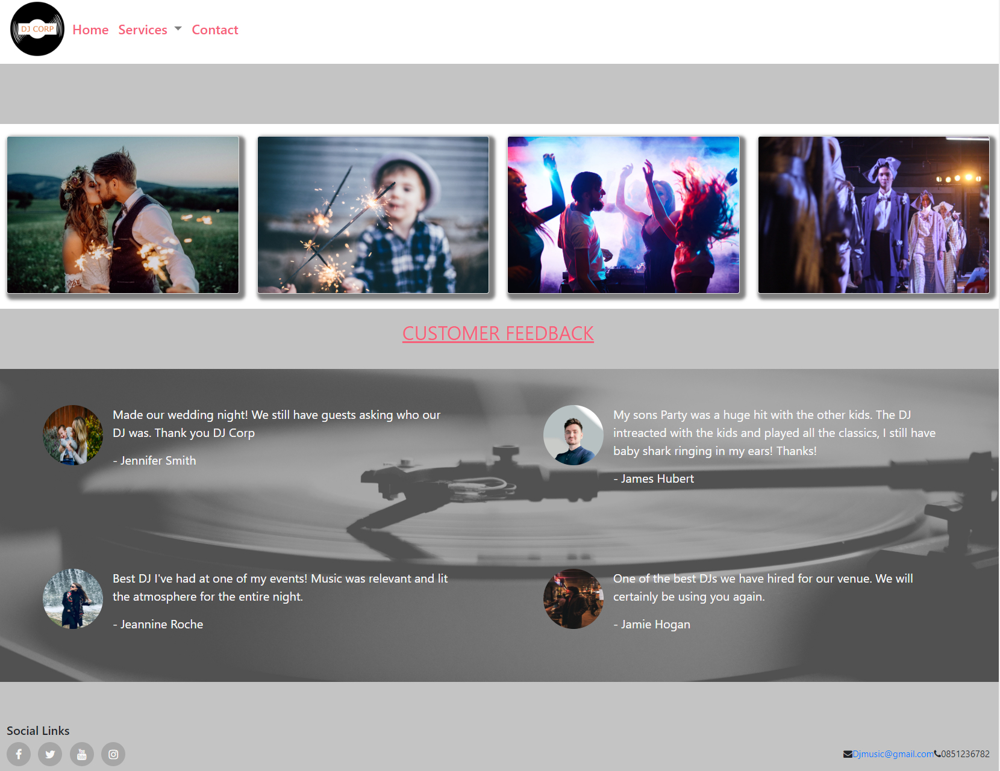

# DJ CORP (A DJ booking website) 

*The Dj corp site is designed to be minimalist and very user friendly with everything directing the user back to the contact page to get in touch about what is on offer and pricing for personal needs.*

## UX

This site is for people looking for a DJ for a number of different reasons. What users should be able to achieve by visiting this site is seeing what services the company offers and reassurance from previous customers about how the DJs performed.

I think my site is the best way for people to achieve what they are looking for because it is clean, easily navigatable and provides enough information that people should be compelled to ask for pricing. I chose the colour screen of white, grey, pink and orange as the pink and orange pops from the screen in contrast to the grey and white drawing the eye to the text. 

## User Stories

### First Time User
a. I want to easily see which sections apply to me.

b. I want to be able to navigate through the website easily.

c. I want to know what services are on offer.

d. I want to be able to see what past users of this company thought of the experience.

e. I want to know how to contact the business to discuss needs and availability.

### Returning User
a. I want to see any updated testimonials

b. I want to be able to leave feedback from my experience with dealing with the company.

c. I want to be able to contact to book/ contact for another date.

## Features

### Customer Feedback 
- This should give reassurance to new clients who visit the page.

### Contact Page 
- This will let the client reach out to the company to find out more and book a DJ for their event

### Landing Page 
- Each Picture is a link with a clear visual representation of what the kind of event the company caters for.

*Each Section (weddings birthdays, Venues and Fashion shows) - should provide a short written description of what the company offers*

## Future ideas 

1. Live calendar to the company and what dates they have DJ's Available. When I have more knowledge in other languages I will look to implement this.

2. A profile page where you can see each Dj the company hires out to clients, past experiences and some comments from other clients.

## Technologies Used

### <a href="https://github.com/MarcSparks7/Milestone-project-UXD/blob/master/Wireframe/wireframe-milestone-ux.pdf" target="_blank">Wireframes</a>
- Balsamiq Wireframes.

### <a href="https://fontawesome.com/" target="_blank">Font Awesome</a>
- used for Icons such as in the wedding section of the website.

### <a href="https://getbootstrap.com/" target="_blank">Bootstrap</a>
- used for styling website through-out 

### <a href="https://cdnjs.com/" target="_blank">JavaScript CDN</a>
- used for collapse of navbar and hamburger icon on mobile.

## Testing

- <a href="https://jigsaw.w3.org/css-validator/#validate_by_input" target="_blank">W3C Markup Validator</a>

- <a href="https://validator.w3.org/" target="_blank">W3c Markup Validator (HTML)</a>

## First Time User

 ### I want to easily see which sections apply to me.

a. Upon entering the site, users are automatically greeted with a clean and easily readable navigation bar to go to the page of their choice. Underneath there are 4 images with built-in hover text drop downs as you scroll over them to understand what the picture represents.

b. The main points are easily understood with the images.

c. The user has two options, either use the navigation bar or click on one of the images.

 ### I want to be able to navigate through the website easily.

a. The site has been designed to be very visually appealing however not distracting. The user can choose to use the navigation bar or the pictures on the home screen to take them to the desired section of the website. 
	
 ### I want to know what services are on offer.

a. Once the user uses one of the relevant links on the Home page, they will be re-directed to a page which breaks down what is offered for each service.

b. Each page should have a small amount of description describing the service for their needs.

c. The user is presented with a HERE link to the contact page so they can ask any further questions or book any dates.

 ### I want to be able to see what past users of this company thought of the experience.

a. On the Home Page the user can see previous testimonials from past clients.

 ### I want to know how to contact the business to discuss needs and availability.
 
a. Within the navigation bar there is a link to the contact page so users can contact the business.

b. On each other page of the website, there is a HERE link to bring them to the contact page clearly visible.

c. Within the footer of each page, there is a mailto link and contact phone number.

## Returning Users

 ### I want to see any updated testimonials

a. These are clearly visible on the home screen of the website.

 ### I want to be able to leave feedback from my experience with dealing with the company/I want to be able to contact to book/ contact for another date.

a. The navigation bar clearly highlights the "Contact" Page.

b. Here they can fill out the form on the page and let the company know anything they wish.

c. The footer contains links to Facebook, Twitter and Instagram page as well as the organization's email.

d. Whichever link they click, it will be open up in a new tab to ensure the user can easily get back to the website.

e. The email button is set up to automatically open up your email app and autofill there email address in the "To" section.

## Additional Testing

- The Website was tested on Google Chrome, Internet Explorer, Microsoft Edge and Safari browsers.
- The website was viewed on a variety of devices such as Desktop, Laptop, iPhone.
- A large amount of testing was done to ensure that all pages were linking correctly.
- Friends and family members were asked to review the site to point out any bugs and/or user experience issues.

### UX on mobile 
- Simple changes were needed to be made for mobile users so that the information was more appealing on a mobile device. e.g removing the profile pictures from the quotes on the landing page. While testing I found that I had to edit the image I used for the quote section as the white writing got lost in the image. 

### Landing page 

- On a desktop, when hovering over the pictures on the landing page I found the writing dropdown was too slow for users to see in time and then changed the timing from 1sec to 0.5 sec.

### Contact form 

- Try to submit the empty form and verify that an error message about the required fields appears.

## Deployment

GitHub Pages
- The project was deployed to GitHub Pages using the following steps...

1. Log in to GitHub and locate the GitHub Repository

2. At the top of the Repository (not top of page), locate the "Settings" button on the menu.

3. Scroll down the Settings page until you locate the "GitHub Pages" Section.

4. Under "Source", click the dropdown called "None" and select "Master Branch".

5. The page will automatically refresh.

6. Scroll back down through the page to locate the now published site link in the "GitHub Pages" section.

 ### Pushing To GitHub
 
- Committing every few lines of code. 

- Pushing the code to Github at the end of each writing session. 

## Credits

- All photos were taken from the website https://unsplash.com/ some of these photos were edited by myself to suit the website with Gimp Photo editor.

- The quote section was an idea taken from the whiskey mini-project.

- I received inspiration for this project from a friend of mine who is a DJ.
